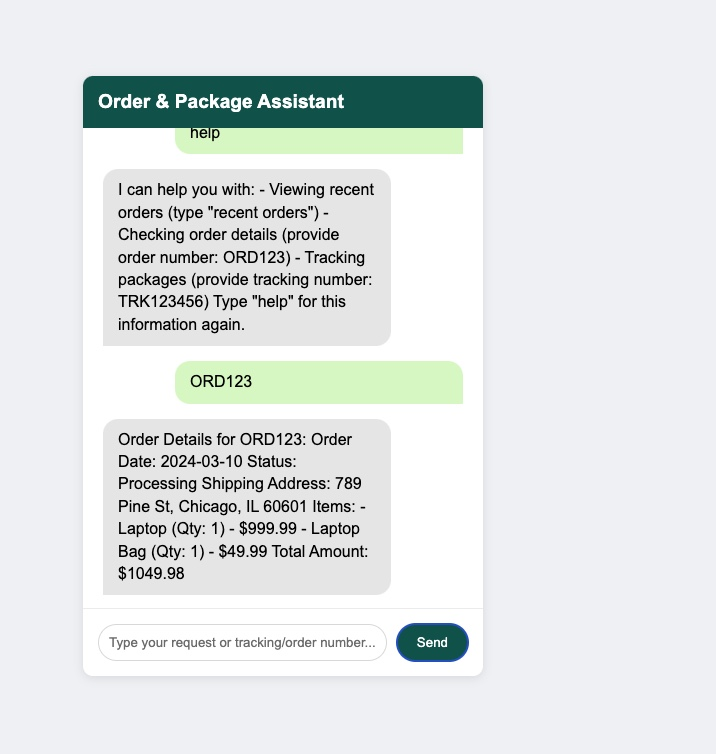

# Order & Package Tracking Assistant

The **Order & Package Tracking Assistant** is a simple web-based chatbot application that allows users to:
- View their recent orders.
- Check order details by providing an order number (e.g., ORD123).
- Track packages by providing a tracking number (e.g., TRK123456).

The assistant uses sample order and package data to simulate interactions and provide responses.

## Features
- **Track Orders**: Retrieve details about orders, including items, total amount, and shipping information.
- **Track Packages**: Check the current status, location, and estimated delivery date of a package.
- **Guided Support**: Provides users with help and instructions to interact with the chatbot.

## Demo

## Getting Started
Follow these steps to run the project locally.

### Prerequisites
- A modern web browser (e.g., Chrome, Firefox, Edge).
- Basic knowledge of HTML, CSS, and JavaScript.

### Installation
1. Clone the repository to your local machine:
   
bash
   git clone https://github.com/yourusername/order-tracking-assistant.git

2. Navigate to the project directory:
   
bash
   cd order-tracking-assistant

3. Open the index.html file in your browser to launch the chatbot.

### File Structure
- **index.html**: The main HTML file that defines the chatbot interface.
- **styles.css**: Stylesheet for the chatbot UI.
- **script.js**: JavaScript file handling the chatbot logic and interactions.

## How to Use
1. Open the chat interface by launching the index.html file in your browser.
2. Type a request or command in the input box. For example:
   - Type "recent orders" to view all recent orders.
   - Provide an order number like ORD123 to view specific details.
   - Provide a tracking number like TRK123456 to track a package.
   - Type "help" to get a list of commands and features.

3. Click the **Send** button or press Enter to submit your query.

## Sample Commands
- **Recent Orders**: recent orders
- **Order Details**: ORD123
- **Track Package**: TRK123456
- **Help**: help

## Example Data
### Sample Orders
- **Order Number**: ORD789
  - Items: Wireless Headphones, Phone Case
  - Status: Shipped
  - Tracking Number: TRK123456

### Sample Packages
- **Tracking Number**: TRK123456
  - Status: In Transit
  - Location: New York Distribution Center

## Future Improvements
- Add a backend for real-time order and package tracking.
- Integrate with APIs from shipping carriers.
- Enhance the conversational AI for more dynamic interactions.

## Contributing
Contributions are welcome! Please follow these steps:
1. Fork the repository.
2. Create a new branch (git checkout -b feature-name).
3. Commit your changes (git commit -m "Add feature").
4. Push to the branch (git push origin feature-name).
5. Open a pull request.

## Contact
If you have questions or need support, feel free to reach out:
- **GitHub**: [pritikabista](https://github.com/pritikabista)
- **Email**: your-pritika.developer@gmail.com
